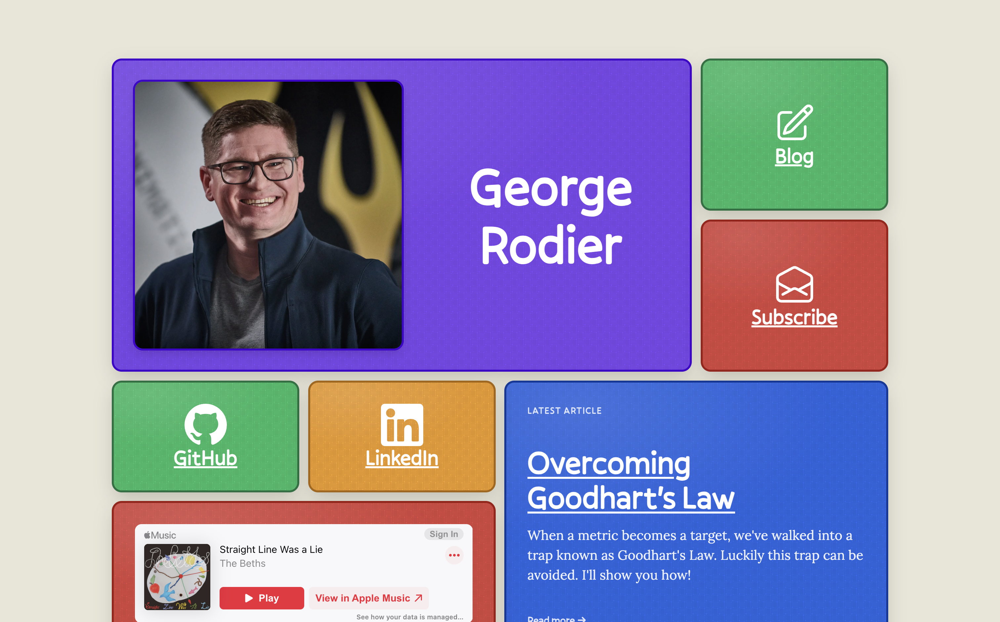
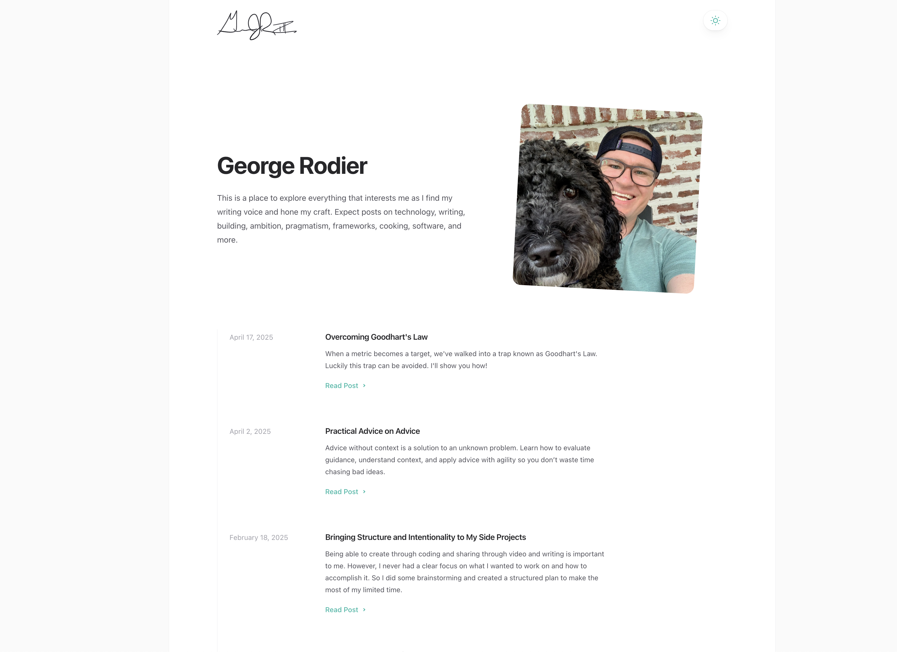
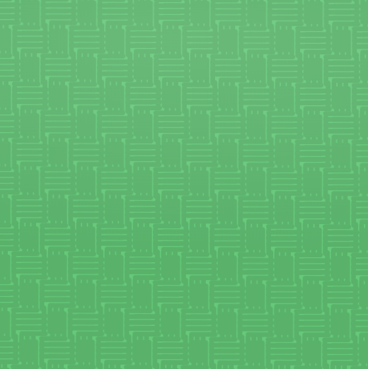
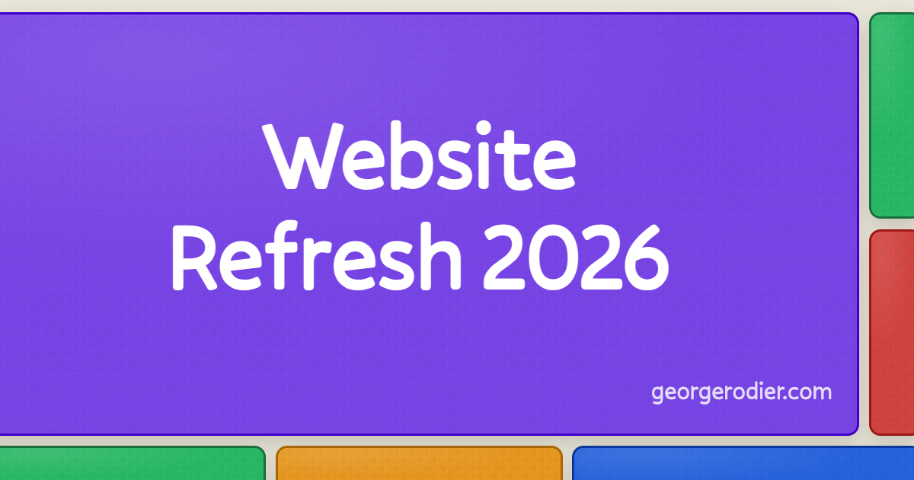

If you have a personal website, I'll usually be the first person to tell you not to waste your time consistently redesigning. You're much better off producing content for the website or working on projects that actually interest you. Pushing pixels without a purpose is almost always a distraction.

Now there are exceptions to that rule. [Lynn Fisher and her yearly redesigns]() are at the top of that list. Or maybe you want to try the latest and greatest CSS property and need a site to experiment on. Or maybe for you having something to continue to iterate on brings you joy. So maybe there are a lot of good reasons...

But for the most part, what you have is probably good enough. And it's advice I remind myself often.

So it should come as no surprise that I disregarded my own advice and redesigned my website.

The previous version of my site lasted for almost exactly 2 years. At the time I created it, I used a heavily modified template. It looked pretty professional, but lacked character. I think it was a great approach to be get something up quickly and then focus on content (which I was kinda meh about).

But now the year is 2026 and things have changed. It's easy to create something with AI that lacks personality. Too many of the web water holes silo your interactions and your data is not really your data (hoping [ATProto](https://atproto.com/) changes that). But we can fight back against the enshittification of the web and personal [sites are our weapons](https://henry.codes/writing/a-website-to-destroy-all-websites/#where-do-we-go-from-here).

So yeah I got the itch.

---

Now just because I got wrapped up in the excitement, didn't mean I was looking to redo my site right away either. It wasn't until I had an idea for a design that I couldn't get out of my head that made we want to go all in on it. And I got that idea when exploring the very early iterations of [blento.app](https://blento.app/).

Blento is a super cool idea that allows you to create "your own corner of the web" built on ATProto with customizable bento box style layout. It's like a customizable new age MySpace. But it's the bento-style layout that caught my attention.

One of the problems I've had with creating a personal site, is I never knew what I wanted it to be. As a developer, I thought it should be a portfolio site that showed off some of my skills. But then I thought, I also enjoy cooking, what if I shared some recipes too. Does that make sense on my portfolio site? Should it be on a separate site that I link to? What's the best way to surface the various content that I might want to talk about?

But all those things are me. And thus they should be on a personal site. The bento style unlocked the idea of having a "hub" of me where i can link off to the various things that help make me "me".

One of the opportunities this homepage hub offers is the ability to continually iterate on the site with new ideas without being pigeon-holed into one particular corner. Outside of blocks I currently have, some of the others I considered included a GitHub contribution chart, resume, current weather, a block with a fun/interesting/inspiring quote, food recipes, bookmarks or interesting articles that I want to highlight and share, contact, and latest social post. And if I ever have a lack of items to work on, I can always dip into this backlog of block ideas to implement.

---

With a bento-style layout decided on, the next thing I needed was a design. To keep with the personal trend, I wanted it to feel less professional and corporate, and more human. Lots of colors was a must. And maybe it's because I have two super young kids and was on paternity leave as I started working on the site, but I decided to tap into the nostalgia of my youth.

The colors of the bento boxes were meant to invoke dodgeballs on a playground. And to really emphasize that point, I created a background for each block that has a dodgeball-like texture. The background color on the entire page was meant to invoke a well played with baseball that had lost it white lust and picked up dirt from the infield. Finally, I created a subtle hover effect that makes it look like the cards are haphazardly being picked up.

Now since I'm not a designer, and thus don't know how to use Figma, Sketch, Photoshop, or whatever your design tool of choice is, I stuck with what I knew best html and css. Honestly, this was super helpful approach that allowed me to subtly adjust colors and contrast and different ideas quickly until I was able to settle on something I liked (or disregard). And don't let anyone tell you it's not a valid approach to designing - [it most certainly is](https://piccalil.li/blog/the-open-source-design-stack/)!

In fact, that design ethos carried out to the rest of the project as well. My favicon was designed with css using the same background and colors as my bento square, screenshotted, background removed with Mac's Preview app, and then size adjusted. Likewise, my social cards (following an approach similar to [Emma Goto](https://www.emgoto.com/astro-social-card/) and [Cassidy Williams](https://cassidoo.co/post/og-image-gen-astro/)) are also entirely CSS with a script to automate screenshot and creation.

---

So now that I have a new website in place, the next steps are to write more, build more, and share more. And not because I have to, but because building community and participating with like-minded individuals brings me a ton of joy. To that end, I've included both an [rss feed](https://georgerodier.com/rss.xml) and a [newsletter](https://georgerodier.com/subscribe/) where you can keep up to date and follow along on my journey.

And I encourage you to participate too! One of the coolest things I've seen recently is the proliferation of new sites being shared on [personalsit.es](https://personalsit.es/) (including mine) and elsewhere on the internet. Much of this is a desire to reclaim a little personal space in the large net of the web. And you can be part of this movement too. Be original. Be intentional. Bring joy.
